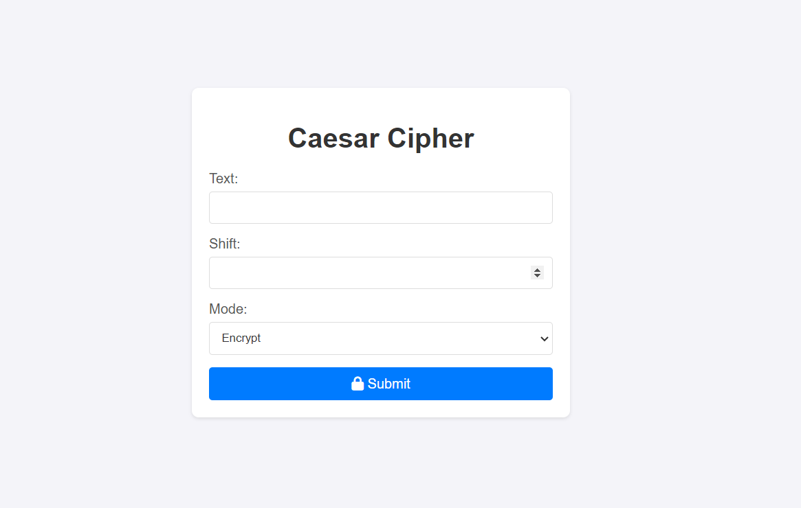

# Ceaser-Cipher
>>>> Flask Ceaser Cipher Tool

    

A simple and interactive Caesar Cipher web application built using Flask, HTML, and CSS. This app allows you to encrypt and decrypt messages with a specified shift value, utilizing the classic Caesar Cipher technique.

## Features

- **Encrypt & Decrypt**: Switch between encrypting and decrypting messages with a simple selection.
- **Interactive Interface**: User-friendly design with form validation.
- **Custom Shift Value**: Choose any shift value between 1 and 25 for flexible ciphering.
- **Responsive Design**: Optimized for both desktop and mobile devices.
  
## Demo



## Installation

To run this project locally, follow these steps:

### Prerequisites

- Python 3.8+
- pip (Python package manager)
- Virtual Environment (Optional but recommended)

### Clone the Repository

```bash
git clone https://github.com/prashant-sagar-shakya/CeaserCipher.git
cd CeaserCipher
```

### Set Up a Virtual Environment

**On Windows:**

```bash
python -m venv venv
venv\Scripts\activate
```

**On macOS/Linux:**

```bash
python3 -m venv venv
source venv/bin/activate
```

### Install Dependencies

```bash
pip install -r requirements.txt
```

### Run the Application

```bash
python app.py
```

Open your web browser and visit [http://127.0.0.1:5000](http://127.0.0.1:5000) to access the application.

## Usage

1. **Enter Text**: Type the text you wish to encrypt or decrypt in the provided input field.
2. **Select Shift**: Choose a shift value between 1 and 25.
3. **Choose Mode**: Select either "Encrypt" or "Decrypt" to determine the operation.
4. **Submit**: Click the submit button to see the transformed text.

## Project Structure

```
CeaserCipher/
│
├── app.py                    # Main Flask application file
├── requirements.txt          # List of dependencies
├── static/                   # Static files directory
│   ├── css/
│   │   └── styles.css        # Custom CSS styles
│   ├── img/                  # Image directory for icons and images
│   │   └── favicon.ico       # Favicon file
└── templates/
    └── index.html            # HTML template for the web interface
```

## Contact

For any inquiries or support, please contact:

- **Name**: Prashant Sagar Shakya
- **Email**: prashant43602003@gmail.com
- **GitHub**: [prashant-sagar-shakya](https://github.com/prashant-sagar-shakya)

## Acknowledgments

- Special thanks to [Font Awesome](https://fontawesome.com/) for providing the icon library used in this project.

---